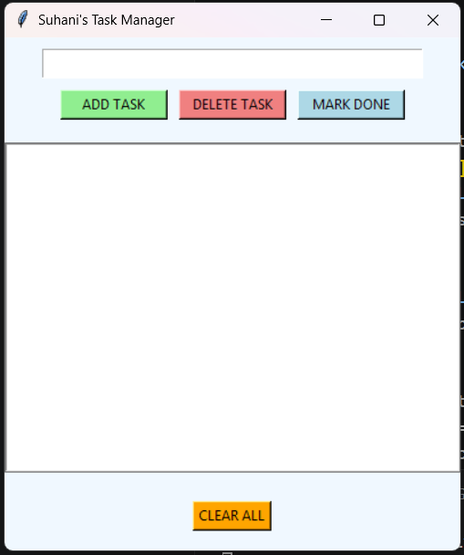
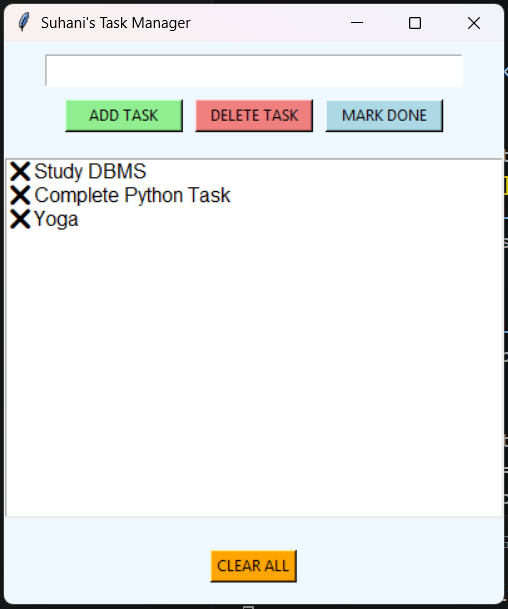
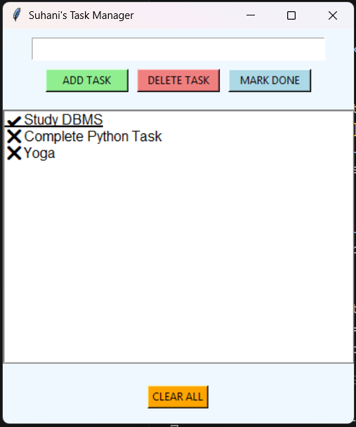
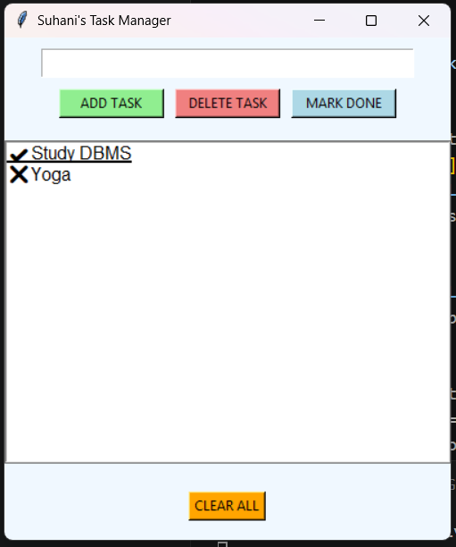

# 📝 To-Do List GUI Application

## 📌 Overview
This project is a GUI-based To-Do List application developed using Python. It allows users to create, update, and manage tasks efficiently using a simple graphical interface.

---

## 🚀 Features
- Add new tasks
- Delete selected tasks
- Mark tasks as completed
- Clear all tasks with confirmation
- Persistent storage using JSON file
- User-friendly GUI using Tkinter

---

## 🛠️ Tech Stack
- Python
- Tkinter
- JSON

---

## 📂 Project Structure
Task-1-ToDo/ │ ├── todo_gui.py ├── README.md └── screenshots/ ├── 1_empty_ui.png ├── 2_tasks_added.png ├── 3_task_completed.png └── 4_task_deleted.png

---

## ▶️ How to Run

1. Install Python
2. Open terminal in this folder
3. Run the command:python todo_gui.py

---

## 📷 Screenshots

### 🔹 Empty UI

---

### 🔹 Tasks Added

---

### 🔹 Task Completed

---

### 🔹 Task Deleted

---

## 🧠 Learning Outcomes
- Learned GUI development using Tkinter
- Understood JSON-based data storage
- Improved Python project structuring
- Gained hands-on experience with user interaction

---

## 📌 Conclusion
This project demonstrates how a simple GUI-based application can improve task management and user experience compared to command-line tools.
