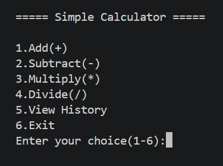
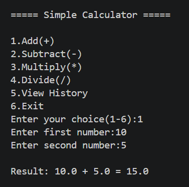
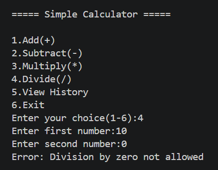
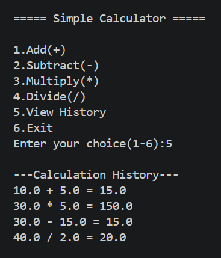

# 🧮 Simple Calculator (Python)

## 📌 Overview
This is a command-line based calculator built using Python. It performs basic arithmetic operations and includes validation and history tracking.

---

## 🚀 Features
- Addition, Subtraction, Multiplication, Division
- Handles division by zero
- Input validation for invalid entries
- Continuous calculations using loop
- Displays calculation history

---

## 🛠️ Tech Stack
- Python

---

## 📂 Project Structure

```
Task-2-Calculator/
│
├── calculator.py
├── README.md
└── screenshots/
    ├── 1_menu.png
    ├── 2_calculation.png
    ├── 3_division_error.png
    └── 4_history.png
```

---

## ▶️ How to Run

1. Open terminal in this folder  
2. Run:

```
python calculator.py
```

---

## 📷 Screenshots

### 🔹 Menu


---

### 🔹 Calculation Example


---

### 🔹 Division by Zero Handling


---

### 🔹 History Feature


---

## 🧠 Learning Outcomes
- Function-based programming
- Input validation
- Loop-based execution
- Structured CLI design
