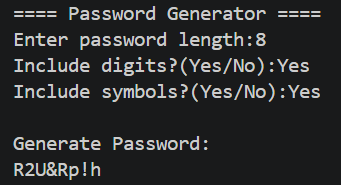
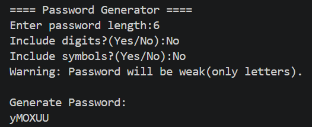
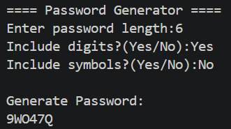
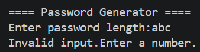

# 🔐 Password Generator (Python)

## 📌 Overview
A Python program that generates secure passwords based on user input. Users can choose password length and whether to include digits and symbols.

---

## 🚀 Features
- Random password generation
- User-defined length
- Option to include digits
- Option to include symbols
- Weak password warning
- Input validation

---

## 🛠️ Tech Stack
- Python
- string module
- secrets module

---

## 📂 Project Structure

```
Task-3-PasswordGenerator/
│
├── password_generator.py
├── README.md
└── screenshots/
    ├── 1_strong.png
    ├── 2_letters_only.png
    ├── 3_digits_only.png
    └── 4_invalid_input.png
```

---

## ▶️ How to Run

1. Open terminal in this folder  
2. Run:

```
python password_generator.py
```

---

## 📷 Screenshots

### 🔹 Strong Password


---

### 🔹 Letters Only


---

### 🔹 Digits Only


---

### 🔹 Invalid Input


---

## 🧠 Learning Outcomes
- Learned random password generation  
- Improved input validation  
- Understood importance of secure logic
